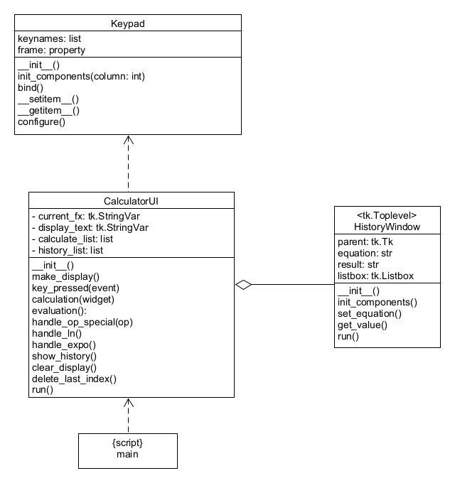

## Files for calculator

| file               | For                                            |
|--------------------|------------------------------------------------|
| `calculator_ui.py` | CalculatorUI, with 2 keypads and display area. |
| `keypad.py`        | Keypad class                                   |
| `history.py`       | Making separate window for history             |
| `main.py`          | script to start the UI                         |

### How to run

```
python main.py
```

### Class UML


